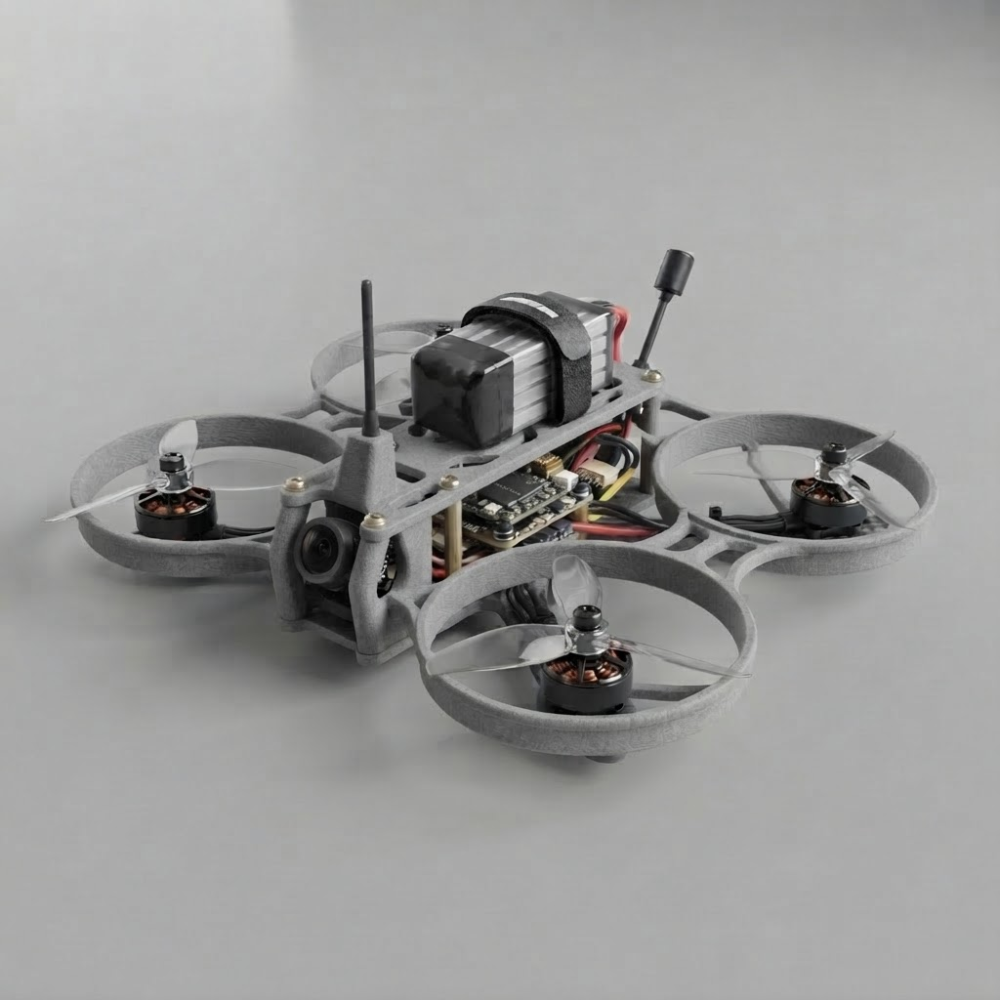

# 75 mm 1S Analog FPV Drone

*Figure 1 — Initial V1 system concept. This image is a concept reference, not a verified mechanical drawing.*

> **Project status:** V1 architecture frozen · Documentation baseline complete · Physical build not yet validated

A small FPV drone developed as an **embedded-electronics, firmware, integration, verification and validation project**.

The goal of this repository is not simply to show a finished drone. It explains **why the system is built this way, what every subsystem does, how the interfaces connect, how to configure it, how to test it, and how to turn the design into measured engineering evidence.**

---

# 1. Start Here: What Is a Drone?

A drone is an aircraft that operates without a pilot physically sitting inside it. In broader aviation terminology, a **UAS (Unmanned Aircraft System)** includes the unmanned aircraft plus the equipment needed to operate it. [FAA — UAS definition](https://www.faa.gov/faq/what-unmanned-aircraft-system-uas)

A quadcopter is a type of drone that uses **four rotating propellers** to generate and control thrust.

This project is a **micro quadcopter**, commonly called a **tiny whoop** in the FPV community.

The simplest mental model is:

~~~
                PILOT
                  │
                  │ radio commands
                  ▼
        ┌────────────────────┐
        │  Radio Receiver    │
        └─────────┬──────────┘
                  │
                  ▼
        ┌────────────────────┐
        │ Flight Controller  │
        │    "the brain"     │
        └──────┬───────┬─────┘
               │       │
        motor commands  │ video/OSD
               │       │
               ▼       ▼
          ESCs/Motors  FPV system
               │       │
               ▼       ▼
             THRUST   VIDEO
               │
               ▼
             FLIGHT
~~~

The flight controller continuously measures aircraft motion, receives pilot commands, calculates the required motor corrections and commands the motors.

The pilot therefore does **not** directly control motor speed.

The pilot requests something like:

> "Roll right."

The flight controller converts that request into different motor commands so the aircraft rolls right.

That distinction is fundamental to understanding the entire project.

---

# 2. How a Quadcopter Flies

A quadcopter has four motors and four propellers.

Each motor produces thrust. By changing the speed of individual motors, the flight controller controls:

- **Throttle** — overall thrust / vertical movement
- **Roll** — rotation left/right
- **Pitch** — rotation forward/backward
- **Yaw** — rotation around the vertical axis

Conceptually:

~~~
                 FRONT

             M1       M2
              ↺       ↻

                 BODY

             M4       M3
              ↻       ↺

                 REAR
~~~

The exact motor numbering and rotation direction must be verified against the final flight-controller configuration. The diagram above is an explanatory model, not the final hardware pinout.

If all four motors rotated in the same direction, the aircraft body would experience a large reaction torque. Alternating motor directions allows the reaction torques to largely cancel. Yaw is then created by changing the relative speeds of the clockwise and counter-clockwise motor groups.

---

# 3. The Drone Is a System, Not a Collection of Parts

The important engineering idea in this project is **interfaces**.

A useful way to think about the drone is:

~~~
BATTERY
   │
   ▼
POWER DISTRIBUTION / REGULATION
   │
   ▼
FLIGHT CONTROLLER
   │
   ├──────────► ESCs ─────────► Motors ─────────► Propellers
   │
   ├──────────► Receiver ─────► Pilot commands
   │
   └──────────► Camera/OSD ───► VTX ───────────► Goggles
~~~

Every arrow is an engineering interface.

For every interface in this repository, ask:

1. Who produces the signal?
2. What exactly is the signal?
3. Who receives it?
4. What voltage/protocol does it use?
5. What is the direction of information flow?
6. How will we verify that it works?

This is why the repository is structured around requirements, architecture, interfaces, integration and verification rather than only around physical components.

---

# 4. V1 System at a Glance

| Subsystem | V1 design |
|---|---|
| Platform | 75 mm micro quad |
| Mission | Indoor + light outdoor |
| Battery | 1S HV LiPo, approximately 450 mAh |
| Connector | BT2.0 |
| Flight controller | BETAFPV F4 1S 5A AIO, Serial ELRS class |
| MCU | STM32F411 |
| IMU | BMI270 |
| Receiver | Integrated Serial ELRS 2.4 GHz |
| ESC | Integrated 1S 4-in-1 ESC |
| Motors | 4 × 0802, approximately 22,000 KV |
| Propellers | 40 mm, 3-blade |
| Camera | Caddx Ant Nano class |
| Video | Analog FPV |
| VTX | Separate analog VTX, AKK Nano3-class |
| Firmware | Betaflight |

The selected BETAFPV F4 1S 5A Serial ELRS board is documented by the manufacturer with an STM32F411CEU6, BMI270, integrated Serial ELRS, 26 × 26 mm mounting, 1S ESC, 5 A continuous / 6 A peak ESC specification, DShot300/600 and 8 MB Blackbox. [BETAFPV F4 1S 5A AIO Serial ELRS documentation](https://betafpv.com/products/f4-1s-5a-aio-brushless-flight-controller-elrs-2-4g)

**Important:** product-family names are not enough to determine final wiring. The exact purchased board revision is the authority for pad labels, firmware target and physical configuration.

---

# 5. Understand the Important Terms Before Building

Use this section as a reference while reading the repository.

## 5.1 Flight Controller (FC)

The **flight controller** is the computer that stabilizes the drone.

In this project it contains:

- STM32F411 microcontroller
- BMI270 inertial sensor
- Betaflight firmware
- integrated Serial ELRS receiver
- integrated 4-in-1 ESC
- analog OSD/video interface
- Blackbox memory

Think of the FC as the central embedded computer.

## 5.2 MCU

**MCU = Microcontroller Unit.**

It is the processor executing the flight-control firmware.

The selected FC uses an **STM32F411CEU6**. [BETAFPV F4 1S 5A AIO Serial ELRS documentation](https://betafpv.com/products/f4-1s-5a-aio-brushless-flight-controller-elrs-2-4g)

## 5.3 IMU

**IMU = Inertial Measurement Unit.**

It measures motion-related quantities such as acceleration and angular rate.

The FC uses this information to determine how the aircraft is moving.

The selected FC uses a **BMI270**. [BETAFPV F4 1S 5A AIO Serial ELRS documentation](https://betafpv.com/products/f4-1s-5a-aio-brushless-flight-controller-elrs-2-4g)

## 5.4 ESC

**ESC = Electronic Speed Controller.**

An ESC converts the flight controller's motor command into electrical switching signals that drive a brushless motor.

This project uses an **AIO FC**, meaning the flight controller and ESC electronics are integrated onto one board.

~~~
Betaflight
    │
    │ motor command
    ▼
ESC
    │
    │ 3-phase switching
    ▼
Brushless motor
    │
    ▼
Propeller
~~~

## 5.5 AIO

**AIO = All-In-One.**

Here it means the flight controller and 4-in-1 ESC are integrated on the same PCB.

It does **not** mean all drone electronics are on one PCB. The camera and analog VTX remain separate.

## 5.6 KV

Motor KV is approximately the motor's no-load rotational-speed constant, expressed in RPM per volt.

A **22,000 KV** motor therefore belongs to a very high-RPM micro-drone motor class.

KV does **not** directly mean motor power.

Actual performance depends on motor construction, voltage, propeller, battery, current capability, aircraft mass and aerodynamic load.

Therefore this repository does not claim flight performance from KV alone.

## 5.7 1S

**1S means one lithium-cell series configuration.**

A conventional 1S LiPo is approximately 3.7 V nominal and 4.2 V when fully charged.

This project uses a 1S architecture to keep the system small and simple.

## 5.8 mAh

**mAh = milliampere-hour.**

It describes battery capacity.

A 450 mAh battery can theoretically supply 450 mA for one hour under idealized conditions.

Real flight time is not calculated directly from mAh because current consumption changes continuously.

Therefore:

> **Flight time is a measured result in this repository, not a guessed specification.**

## 5.9 BT2.0

BT2.0 is the battery connector used by the selected architecture.

It provides the physical electrical connection between the battery and drone.

## 5.10 ELRS

**ExpressLRS (ELRS)** is the radio-control link used between the pilot's transmitter and aircraft.

This project uses an **integrated 2.4 GHz Serial ELRS receiver**.

~~~
Pilot transmitter
      │
      │ 2.4 GHz RF
      ▼
Integrated ELRS receiver
      │
      │ CRSF
      ▼
Flight controller
~~~

ExpressLRS documents CRSF as the serial protocol used between UART-based receivers and the flight controller. [ExpressLRS receiver/FC configuration documentation](https://www.expresslrs.org/quick-start/receivers/configuring-fc/)

## 5.11 CRSF

**CRSF = Crossfire Serial Protocol.**

It is the serial communication protocol used to transfer receiver/control information between an ELRS receiver and flight controller.

Do not confuse:

- **ELRS** → radio link technology
- **CRSF** → serial communication protocol between receiver and FC

## 5.12 Betaflight

**Betaflight** is the flight-controller firmware/configuration ecosystem used in this project.

It handles functions including:

- sensor processing
- stabilization
- motor mixing
- receiver input
- arming
- failsafe
- OSD
- motor output
- Blackbox logging
- configuration

The Betaflight setup guide recommends configuring and testing failsafe and performing bench checks without propellers before flight. [Betaflight Setup Guide](https://betaflight.com/docs/wiki/getting-started/setup-guide)

## 5.13 PID

**PID = Proportional, Integral, Derivative.**

A PID controller compares desired aircraft motion with measured motion and calculates a correction.

~~~
Desired attitude
      │
      ▼
    ERROR ◄──── Measured attitude
      │
      ▼
    PID
      │
      ▼
Motor corrections
~~~

You do not need to tune PID values to understand the first build.

For V1, the priority is:

**correct hardware → correct configuration → safe flight → measurements → tuning.**

## 5.14 DShot

**DShot** is a digital protocol used to communicate motor commands from the flight controller to compatible ESCs.

The selected FC supports DShot300 and DShot600. [BETAFPV F4 1S 5A AIO Serial ELRS documentation](https://betafpv.com/products/f4-1s-5a-aio-brushless-flight-controller-elrs-2-4g)

## 5.15 Analog FPV

Analog FPV sends the camera image as an analog video signal.

The V1 signal chain is:

~~~
Camera
  │
  │ CVBS
  ▼
FC CAM input
  │
  │ OSD insertion
  ▼
FC VTX output
  │
  ▼
Analog VTX
  │
  │ 5.8 GHz RF
  ▼
FPV goggles / receiver
~~~

**CVBS** is the analog composite video signal.

## 5.16 VTX

**VTX = Video Transmitter.**

It converts the camera/video signal into a radio-frequency transmission for the FPV receiver.

The project intentionally uses a **separate VTX**. This adds some wiring and weight, but makes the video subsystem visible and independently testable.

## 5.17 OSD

**OSD = On-Screen Display.**

The flight controller can insert information such as battery voltage, flight time and warnings into the analog video stream.

Therefore:

~~~
Camera → FC → OSD → VTX
~~~

## 5.18 Blackbox

**Blackbox** is flight-controller logging.

It records internal flight data for troubleshooting, control analysis, filtering analysis, vibration investigation, tuning and post-flight engineering review.

The selected BETAFPV FC is documented with 8 MB Blackbox memory. [BETAFPV F4 1S 5A AIO Serial ELRS documentation](https://betafpv.com/products/f4-1s-5a-aio-brushless-flight-controller-elrs-2-4g)

## 5.19 Failsafe

Failsafe defines what the aircraft does when radio control is lost.

It is not an optional feature to ignore until the end.

Betaflight documents multiple failsafe stages and explicitly requires failsafe testing before flight. [Betaflight Failsafe documentation](https://betaflight.com/docs/wiki/guides/current/Failsafe)

For this project:

> **No first flight until failsafe behavior has been configured and bench-tested.**

---

# 6. Complete V1 Architecture

~~~
                         ┌───────────────────┐
                         │     1S LiPo       │
                         │    ~450 mAh        │
                         └─────────┬─────────┘
                                   │ BT2.0
                                   ▼
                  ┌────────────────────────────────┐
                  │       F4 1S 5A AIO FC          │
                  │                                │
                  │ STM32F411                      │
                  │ BMI270                         │
                  │ Betaflight                     │
                  │ Serial ELRS                    │
                  │ 4-in-1 ESC                     │
                  │ OSD / Blackbox                 │
                  └───────┬──────────────┬─────────┘
                          │              │
                    DShot │              │ CRSF
                          │              │
              ┌───────────┘              └─────────────┐
              ▼                                        ▼
       ┌─────────────┐                         ┌──────────────┐
       │ 4-in-1 ESC  │                         │ ELRS Receiver│
       └──┬─┬─┬─┬────┘                         └──────────────┘
          │ │ │ │
          ▼ ▼ ▼ ▼
         M1 M2 M3 M4
          │ │ │ │
          ▼ ▼ ▼ ▼
       Brushless motors
          │ │ │ │
          ▼ ▼ ▼ ▼
        Propellers
          │
          ▼
         THRUST

 Camera
   │
   │ CVBS
   ▼
 FC CAM input
   │
   │ OSD
   ▼
 FC VTX output
   │
   ▼
 Analog VTX
   │
   │ 5.8 GHz
   ▼
 FPV goggles
~~~

---

# 7. Why These Components?

The design was frozen using these priorities:

1. Germany/EU sourcing and replaceability
2. Electronics learning value
3. Assembly and debugging simplicity
4. Cost
5. Flight performance

The selection is therefore deliberately **not** just "the lightest possible drone."

The VTX choice is currently treated as a **reference class**, not a procurement lock. AKK Nano3 is a useful architecture reference for a small separate analog VTX, but the exact V1 VTX will be frozen only after a currently available Germany/EU source and the exact hardware revision are verified.

The architecture should allow the reader to understand:

> **power → computation → sensing → communication → actuation → video → testing**

---

# 8. Engineering Development Process

This project follows a simplified engineering V-model.

~~~
                 REQUIREMENTS
                      │
                      ▼
              SYSTEM ARCHITECTURE
                      │
                      ▼
             SUBSYSTEM ARCHITECTURE
                      │
                      ▼
              ELECTRICAL / FIRMWARE
                      │
                      ▼
                   BUILD
                      │
                      ▼
                INTEGRATION
                      │
                      ▼
                VERIFICATION
                      │
                      ▼
                 VALIDATION
                      │
                      ▼
               FLIGHT EVIDENCE
                      │
                      ▼
                  ITERATION
~~~

The left side answers:

> **What are we designing?**

The right side answers:

> **Did we actually build what we designed, and does it work for the intended mission?**

---

# 9. How to Read This Repository

Read the folders in numerical order.

## 01 — Requirements

Start here.

Learn what the drone must do, what is frozen, what is out of scope, and how each requirement will eventually be verified.

→ [01_Requirements](01_Requirements/)

## 02 — System Architecture

Understand how requirements become a system.

Learn the system block diagram, subsystems, information flow and electrical interfaces.

→ [02_System_Architecture](02_System_Architecture/)

## 03 — Component Selection

Ask: **Why these components?**

Learn the FC, propulsion, video architecture and design trade-offs.

→ [03_Component_Selection](03_Component_Selection/)

## 04 — BOM

Identify everything needed to reproduce the design.

Learn the parts list, quantities, exact-part/revision requirements and sourcing strategy.

→ [04_BOM](04_BOM/)

## 05 — Electrical Design

This is the core electronics section.

Learn power, motor interfaces, camera, analog video, VTX, SmartAudio, ELRS/CRSF and FC functional pinout.

Do not skip this section before wiring.

→ [05_Electrical_Design](05_Electrical_Design/)

## 06 — Firmware

Understand the software running on the hardware.

Learn Betaflight, receiver configuration, motor protocol, ELRS, failsafe, CLI and configuration backups.

→ [06_Firmware](06_Firmware/)

## 07 — Integration

Physically combine the system.

The intended sequence is:

~~~
Inspect
  ↓
Continuity
  ↓
USB / FC
  ↓
Receiver
  ↓
Motors
  ↓
Video
  ↓
Final assembly
  ↓
Flight
~~~

Do not jump from soldering directly to flight.

→ [07_Integration](07_Integration/)

## 08 — Verification

Verification asks:

> **Does the implementation satisfy the technical requirements?**

Examples:

- Does the FC boot?
- Does the IMU work?
- Does ELRS work?
- Does each motor respond correctly?
- Does the camera produce video?
- Does OSD work?
- Does failsafe behave correctly?

→ [08_Verification](08_Verification/)

## 09 — Validation

Validation asks:

> **Does the complete drone actually work for the intended mission?**

Examples:

- Can it hover?
- Is indoor flight controllable?
- Is light outdoor operation practical?
- What is the measured flight time?
- What temperatures occur?
- What problems appear repeatedly?

→ [09_Validation](09_Validation/)

## 10 — Iterations

Record every significant change as:

~~~
Problem
   ↓
Evidence
   ↓
Change
   ↓
Expected effect
   ↓
Verification
   ↓
Result
~~~

→ [10_Iterations](10_Iterations/)

## 11 — Mechanical

Mechanical design is deliberately lightweight in V1.

This section covers the frame, packaging, clearances, battery retention, camera/VTX mounting and optional supporting 3D prints.

→ [11_Mechanical](11_Mechanical/)

## 12 — References

This is the engineering evidence library.

Use it for manufacturer documentation, firmware references, datasheets, sourcing evidence and community research.

→ [12_References](12_References/)

---

# 10. Actual Build Procedure

If you want to build the drone rather than only study it, follow this sequence.

### Phase 1 — Understand

- Read this README completely.
- Read 01 Requirements.
- Read 02 System Architecture.
- Read 03 Component Selection.

### Phase 2 — Procure

- Read 04 BOM.
- Select exact part numbers.
- Record manufacturer and revision.
- Record source and date.
- Download relevant datasheets/manuals.

### Phase 3 — Inspect

Before soldering:

- identify every board
- identify the exact FC revision
- photograph the FC
- confirm pad labels
- confirm connector polarity
- compare the board against manufacturer documentation

### Phase 4 — Electrical preparation

Read:

- 05 Electrical Design / electrical architecture
- 05 Electrical Design / signal interfaces
- 05 Electrical Design / pinout
- 05 Electrical Design / power budget

Do not invent a pinout from a similar-looking board.

### Phase 5 — Assembly

Follow:

- 07 Integration / assembly
- 07 Integration / wiring procedure
- 07 Integration / bring-up checklist

### Phase 6 — Firmware

Follow:

- 06 Firmware / firmware setup
- 06 Firmware / ELRS setup
- 06 Firmware / CLI baseline

Always save the original configuration before making major firmware changes.

### Phase 7 — Bench verification

Use:

- 08 Verification / test matrix
- 08 Verification / test procedures

**Propellers stay OFF during bench motor testing.**

Betaflight's setup guidance emphasizes safety, failsafe configuration and bench testing without propellers before flight. [Betaflight Setup Guide](https://betaflight.com/docs/wiki/getting-started/setup-guide)

### Phase 8 — First flight

Only after bench tests pass:

1. Install the correct propellers.
2. Check motor direction again.
3. Check arming behavior.
4. Confirm failsafe.
5. Inspect the battery.
6. Move to a controlled flight area.
7. Perform a short hover.
8. Land.
9. Inspect the aircraft.
10. Record the result.

### Phase 9 — Validation

Record:

- battery
- duration
- weight
- voltage
- current where measurable
- temperature
- environment
- firmware configuration
- video
- Blackbox data
- observations

### Phase 10 — Iterate

Do not hide failures.

Record:

**what happened → why it mattered → what changed → how it was verified.**

---

# 11. Design Status Convention

Every engineering statement should fall into one of three categories.

### DESIGNED

The value is part of the intended design.

Example: 1S battery architecture.

### VERIFIED

The value has been checked against documentation, hardware inspection or configuration.

Example: the purchased FC is confirmed to be the Serial ELRS BMI270 revision.

### MEASURED

The value came from physical testing.

Example: measured AUW = XX.X g.

Do not turn:

**DESIGNED → VERIFIED → MEASURED**

without evidence.

This is one of the most important principles of the repository.

---

# 12. What This Repository Is Trying to Teach

Someone reading this repository from beginning to end should understand more than how to solder a tiny quad.

They should understand a repeatable engineering process:

~~~
Requirement
    ↓
Architecture
    ↓
Component selection
    ↓
Interface definition
    ↓
Implementation
    ↓
Firmware
    ↓
Integration
    ↓
Verification
    ↓
Validation
    ↓
Measured evidence
    ↓
Iteration
~~~

That process can be reused for robots, embedded controllers, autonomous systems, avionics prototypes, sensor systems, industrial electronics and robotics platforms.

The drone is the physical example.

The real project is the **engineering workflow**.

---

# 13. Important Safety Rules

This is a real aircraft with rotating machinery, lithium batteries and RF electronics.

At minimum:

- Never test motors with propellers installed.
- Check battery polarity before connecting power.
- Inspect solder joints before powering the system.
- Do not operate a VTX without its antenna connected.
- Keep fingers, wires and tools away from rotating propellers.
- Verify failsafe before flight.
- First flights should be performed in a controlled environment.
- Follow applicable local aviation, RF and battery-safety requirements.

Betaflight's current documentation specifically emphasizes failsafe setup and testing before flight. [Betaflight Failsafe documentation](https://betaflight.com/docs/wiki/guides/current/Failsafe) and [Setup Guide](https://betaflight.com/docs/wiki/getting-started/setup-guide)

---

# 14. What Is Still Unknown?

The repository intentionally contains TBD/VERIFY items.

These represent engineering information that cannot honestly be finalized until the physical hardware is identified.

Examples:

- exact FC hardware revision
- exact motor part number
- exact camera revision
- exact VTX revision
- final pad-level mapping
- final battery model
- measured aircraft mass
- measured current
- measured flight time
- measured temperatures
- actual Blackbox results
- actual flight behavior

The next stage is therefore **not more theoretical design**.

It is:

> **Procure → inspect → build → configure → test → measure → update the repository.**

---

# 15. Engineering References

Primary references used for the current baseline:

- [BETAFPV F4 1S 5A AIO Serial ELRS](https://betafpv.com/products/f4-1s-5a-aio-brushless-flight-controller-elrs-2-4g)
- [Betaflight Setup Guide](https://betaflight.com/docs/wiki/getting-started/setup-guide)
- [Betaflight Failsafe](https://betaflight.com/docs/wiki/guides/current/Failsafe)
- [ExpressLRS — Configuring the Flight Controller](https://www.expresslrs.org/quick-start/receivers/configuring-fc/)
- [FAA — UAS definition](https://www.faa.gov/faq/what-unmanned-aircraft-system-uas)

Detailed manufacturer and research sources are maintained in [12_References](12_References/).

---

# 16. Repository Map

| Folder | Question it answers |
|---|---|
| [01_Requirements](01_Requirements/) | **What must the drone do?** |
| [02_System_Architecture](02_System_Architecture/) | **How is the system organized?** |
| [03_Component_Selection](03_Component_Selection/) | **Why these components?** |
| [04_BOM](04_BOM/) | **What do I need to build it?** |
| [05_Electrical_Design](05_Electrical_Design/) | **How do I connect everything?** |
| [06_Firmware](06_Firmware/) | **What software/configuration makes it work?** |
| [07_Integration](07_Integration/) | **How do I assemble and bring it up safely?** |
| [08_Verification](08_Verification/) | **Does the implementation work correctly?** |
| [09_Validation](09_Validation/) | **Does the complete drone meet the mission?** |
| [10_Iterations](10_Iterations/) | **What changed and why?** |
| [11_Mechanical](11_Mechanical/) | **How are the physical parts packaged?** |
| [12_References](12_References/) | **What evidence supports the design?** |

---

# 17. One-Sentence Summary

**This repository documents the complete engineering path from "What is a drone?" to "Here is a tested, measured and reproducible 75 mm 1S FPV aircraft."**
